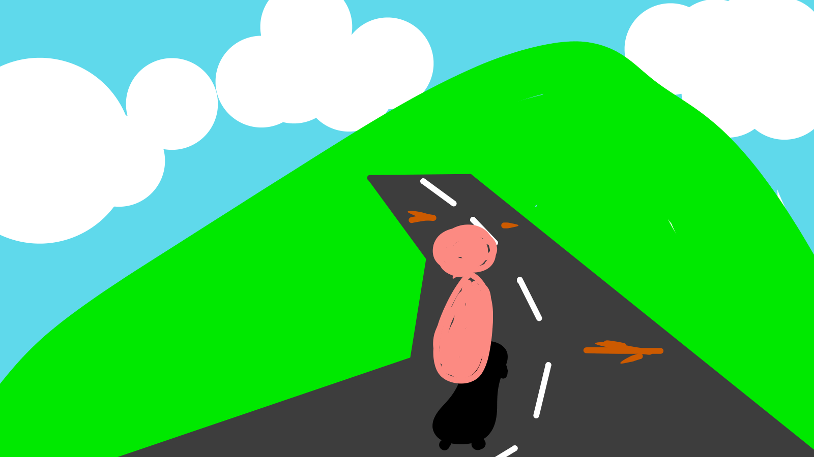

# Street Escape

Author: Rafael Rivera

Design:
No (real) game this week, would have been a WASD to move with an acceleration down the hill, and you try to dodge obstacles (path edges),  hitting them will kill your momentum and the police may catch up. 
Using a street-style hill because I remembered the "away from avalanche" type of game has been done via Sonic Adventure.
Instead, you're chased by a police car as you bomb down a hill on a skateboard.

Screen Shot:

How To Play:
WD to control left/right, no jumping because that'd be too complicated (I know I didn't make it but I tried to scale my initial idea with the plan to implement it, so I'm including details about how I intended to make it more easy). 

Sources: 

This game was built with [NEST](NEST.md).

